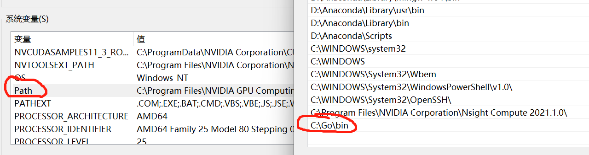

* [Go青训](#go青训)
* [vs配置go环境](#vs配置go环境)
* [写在最后](#写在最后)

# Go青训

# vs配置go环境

1. 官网下载合适版本的[vs](https://code.visualstudio.com/)

2. 下载合适版本的[golang](https://golang.google.cn/dl/)，解压安装，eg：安装到C:\\Go

3. 选择一个地方创建工作空间（就是以后要写的go代码存放地），eg：D:\\go

4. 在工作空间下新建三个空文件夹，如下所示 

   

5. 配置系统环境变量，新建两个环境变量如下，（注意若要变更GOPATH路径，需要把原来`GOPATH`里的`pkg`、`bin`、`src`三个文件夹也复制过去，不然到时候开发时又要重新配置依赖包）

   

6. 打开path，添加环境变量

   

7. 环境配完，打开VS，按图中步骤安装插件

   

8. 在工作环境下创建个测试文件，如下，然后关闭VS，重启VS

   

9. 发现右下角提示安装依赖，直接安装因为墙的原因没发成功

   

10. 打开cmd，输入下列语句，然后重启VS

    ```go
    go env -w GO111MODULE=on
    go env -w GOPROXY=https://goproxy.io,direct
    ```

11.  再安装，应该就可以了，最后GO的环境如下所示，此时按F5就可运行代码

    

12. 注：可以在加一步，按ctrl+shift+p，输入下面内容

    

选择第一个命令，再按下面选择，开始安装（更新）


# 写在最后

FUCK，JetBrains yyds
